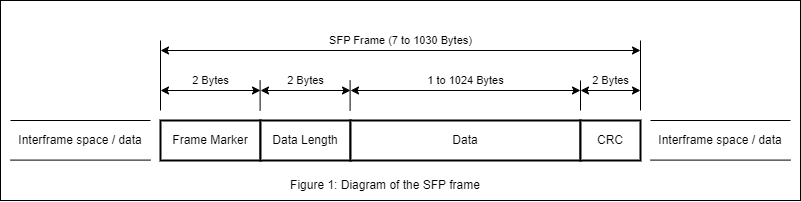

# Serial Frame Protocol (SFP)

## Overview
This protocol is used for communication on a serial bus (UART, USB) between two nodes (microcontroller and computer), to exchange data using frames (packets) in a duplex system.
The main scope of this protocol is to enable exchange of [Protocol Data Units](https://en.wikipedia.org/wiki/Protocol_data_unit) (PDUs) between host PC and the embedded MCU (microcontroller unit) in the most simple, reliable and straigh-forward way, maintaining coexistence of other types of data transmissions on the physical bus.
The key features of this protocol are:
- Bi-directional transmission of data frames with variable lenght
- Frame CRC for data integrity check
- No disruption of other data on the serial bus, such as ASCII characters or other frames

## Protocol Description
### Sending Frame
At any point in time, any one of the two nodes can send an SFP frame on the serial bus.
For a valid frame to be sent, the sender has to send first the **Frame Marker** ([SFP_FRAME_MARKER](#serial-frame-protocol-parameters)) followed by the 16 bit wide length of the data packet (**Data Length**) that can be from [SFP_DATA_LEN_MIN](#serial-frame-protocol-parameters) up until [SFP_DATA_LEN_MAX](#serial-frame-protocol-parameters) bytes, followed by the data packet itself (**Data**), unpadded, then, the 16 bit **CRC** calculate on the Data Length and Data fields.

### Receiving Frame
To receive an SFP frame, the receiver has to implement a state machine that processes the incoming bytes from the serial bus in a following way.
Wait for two bytes of the **Frame Marker**. While doing so, discard or re-route other data to other consumers. After when the **Frame Marker** was received successfuly, check for the next 2 bytes - **Data Length** field, to have value between [SFP_DATA_LEN_MIN](#serial-frame-protocol-parameters) and [SFP_DATA_LEN_MAX](#serial-frame-protocol-parameters) inclusive. Once the data lenght is successfully validated, continue reading that amount of **Data** bytes. After that, read the following 2 bytes of **CRC** and compare it to the calculated CRC on the joined bytes of **Data Length** and **Data** fields. If the comparison is equal, the receiving of frame successfuly completed. If at any point, any check fails, discard or re-route received bytes to other consumers.

### Frame Structure

## Implementation Considerations
TODO
<!-- Provide guidance and recommendations for implementing the protocol on both the sender and receiver sides. Include information on hardware requirements, software libraries, and best practices for robust communication. -->

## References
- [UART](https://en.wikipedia.org/wiki/Universal_asynchronous_receiver-transmitter)
- [USB](https://en.wikipedia.org/wiki/USB)
- [Cyclic redundancy check](https://en.wikipedia.org/wiki/Cyclic_redundancy_check)

## Appendix
### Serial Frame Protocol parameters

| Parameter         |     Value     |
|-------------------|:-------------:|
| SFP_FRAME_MARKER  | [0xAA, 0xAA]  |
| SFP_DATA_LEN_MIN  | 1             |
| SFP_DATA_LEN_MAX  | 1024          |
| SFP_CRC_TYPE      | CRC-16-CCITT  |
| SFP_VERSION       | 0.1.0         |
